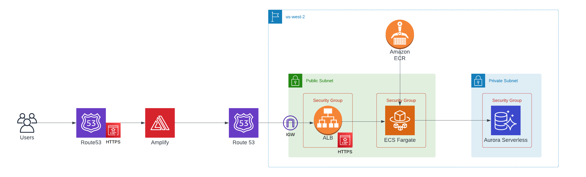

# Infrastructure

The infrastructure was created using `docker`, `terraform` and `AWS`.

## Infrastructure Diagram

I have deployed the ECS/Fargate service in the public subnet and commented out the NAT Gateway and RDS resources to save on AWS costs as they are not required to be deployed for this template to function correctly.



<div style="text-align:center">
  <a href="https://lucid.app/lucidchart/35adafd2-37bd-4477-bb42-253264c65b92/edit?invitationId=inv_c0ca998c-fc75-436f-9ef0-fed2b64c29bb">Infrastructure Diagram</a>
</div>

## Frontend

To deploy the infrastructure remotely you can rely on `.github/workflows/deploy_frontend_infra.yml` (CI/CD with GitHub Actions). All secrets that are required during deployment are defined as GitHub Repository Secrets, therefore add the following GitHub Secret to the repository.

```bash
GH_PERSONAL_ACCESS_TOKEN="TODO"
```

To deploy the infrastructure from your local machine, execute `make deploy-infra-frontend` (NOTE: Terraform variable inputs are defined in `infra/frontend/prod.tfvars`). You must set the following environment variables locally before deploying:

```bash
export TF_VAR_gh_personal_access_token="TODO"
```

## Backend

NOTE: Currently the `S3` backend that is configured in `infra/backend/terraform_backend.tf` is set up for `prod`. To use a different backend you must manually update the `key` field in the backend (which will ensure you do not change the infrastructure of the production environment accidentally).

To deploy the infrastructure remotely you can rely on `.github/workflows/deploy_backend_infra.yml` (CI/CD with GitHub Actions). All secrets that are required during deployment are defined as GitHub Repository Secrets.

To deploy the infrastructure from your local machine, execute `make deploy-infra-backend` (NOTE: Terraform variable inputs are defined in `infra/backend/prod.tfvars`). You must set the following environment variables locally before deploying:

```bash
export TF_VAR_secret_key="TODO"
export TF_VAR_sql_password="TODO"
```

To use an external `PostgreSQL` RDS database as the database instead of a `SQLite3` file-based database on the ECS Fargate Tasks, uncomment the RDS code in `rds.tf`, `ecs.tf`, and `outputs.tf` and change the `database_type` to `postgres` in `prod.tfvars`. NOTE: A NAT Gateway is required for ECS/Fargate to work if it is not deployed in a public subnet with a public IP since it must pull the ECR image for the container.

## References

[1] https://dev.to/daiquiri_team/deploying-django-application-on-aws-with-terraform-minimal-working-setup-587g \
[2] https://medium.com/@Markus.Hanslik/setting-up-an-ssl-certificate-using-aws-and-terraform-198c6fb90743 \
[3] https://testdriven.io/blog/dockerizing-django-with-postgres-gunicorn-and-nginx
